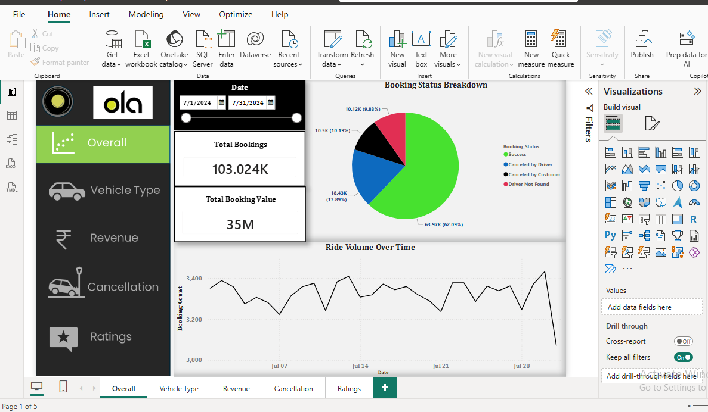

📊 Ola Ride Bookings Analysis

📝 Overview
An end-to-end data analytics project that transforms 103,000+ raw Ola ride booking records into strategic business insights. The project covers database design, SQL-based business analytics, and interactive dashboard modeling to understand why a large share of ride bookings never complete, and where the business should focus to fix it.

📅 Dataset
The project analyzes a ride-booking dataset from Ola (Bengaluru) covering July 2024:
- **Size:** 103,024 rows and 20 columns
- **Key Features:** Booking ID, Date, Time, Booking Status, Customer ID, Vehicle Type, Pickup Location, Drop Location, V_TAT, C_TAT, Canceled Rides by Customer, Canceled Rides by Driver, Incomplete Rides, Incomplete Rides Reason, Booking Value, Payment Method, Ride Distance, Driver Ratings, Customer Rating, Vehicle Images

🛠️ Tools & Technologies Used
- **Data Structuring:** Excel (raw source), MySQL (schema design)
- **Database & Analytics:** MySQL / SQL (Views, Aggregations, Filtering)
- **Data Visualization & Modeling:** Power BI Desktop (DAX Modeling)
- **Presentation & Reporting:** PowerPoint (project deck + dashboard snapshots)

🏃‍♂️ Project Architecture & Steps

**1. Data Structuring (MySQL)**
Loaded 103,000+ raw booking records into a structured MySQL table (`Bookings`), handling nulls and inconsistent value types (e.g., TAT fields kept as `VARCHAR` to safely absorb blank strings) before analysis.

**2. Business Analytics (SQL)**
Built 10 SQL views to answer real business questions directly from the database, including:
- Successful bookings and total revenue from completed rides
- Average ride distance and average customer rating by vehicle type
- Top 5 customers by ride count
- Cancelled rides broken down by customer reason and by driver reason
- Max/min driver ratings for Prime Sedan bookings
- Incomplete rides with reasons

**3. Interactive Visualization (Power BI)**
Connected Power BI directly to the MySQL data and built a 5-page interactive dashboard. Wrote DAX measures for KPI tracking (Total Bookings, Total Booking Value, Success Rate, Cancellation Rate) and built drill-down filters by Vehicle Type, Payment Method, and Date.

**4. Executive Reporting (PowerPoint)**
Packaged the full analysis into a presentation deck summarizing the problem, approach, dashboard, and key findings for a non-technical audience — plus a raw dashboard-screenshot deck for quick reference.

📊 Dashboard Snapshot

*Overall Performance page — 103K bookings, ₹3.5 Cr total value, 62% success rate, tracked daily across July 2024.*

> **Note:** GitHub can't preview `.pptx` files directly in the browser — click **Download** on `Ola_Ride_Bookings_Analysis.pptx` or `Ola_Dashboard_Raw_Screenshots.pptx` to view the full dashboard in PowerPoint or LibreOffice.

The full dashboard has 5 pages:

| Page | What it shows |
|---|---|
| **Overall** | Total bookings, total booking value, booking status breakdown, ride volume over time |
| **Vehicle Type** | Total & success booking value, average and total distance per vehicle type |
| **Revenue** | Revenue by payment method, top 5 customers by booking value |
| **Cancellation** | Cancellation reasons split by customer and by driver |
| **Ratings** | Average driver and customer ratings per vehicle type |

✅ Key Findings
1. **62% of bookings succeed** — the remaining 38% are lost almost equally to driver cancellations, customer cancellations, and unmatched drivers.
2. **No single vehicle type drives the business** — revenue and booking value are balanced across Sedan, SUV, Auto, Bike, and E-Bike.
3. **Cancellations have two different root causes** — customers cancel mainly when the driver isn't approaching them; drivers cancel mainly over personal or vehicle issues.
4. **Service quality is consistent** — driver and customer ratings hold steady around 4.0/5 across every vehicle type, meaning the completion problem is operational, not a customer experience problem.

▶️ How to Run
1. Create the database and run the schema + views from [`ola_sql_queries.sql`](./ola_sql_queries.sql)
2. Import `Bookings-100000-Rows.xlsx` (as CSV) into the `Bookings` table using `LOAD DATA LOCAL INFILE`
3. Explore the SQL views to inspect each business answer
4. Download [`Ola_Ride_Bookings_Analysis.pptx`](./Ola_Ride_Bookings_Analysis.pptx) for the full walkthrough, or [`Ola_Dashboard_Raw_Screenshots.pptx`](./Ola_Dashboard_Raw_Screenshots.pptx) for raw dashboard pages

📬 Contact
I'm currently looking for **Data Analyst** roles. Feel free to explore the project, raise an issue, or connect with me if you'd like to discuss it further.
